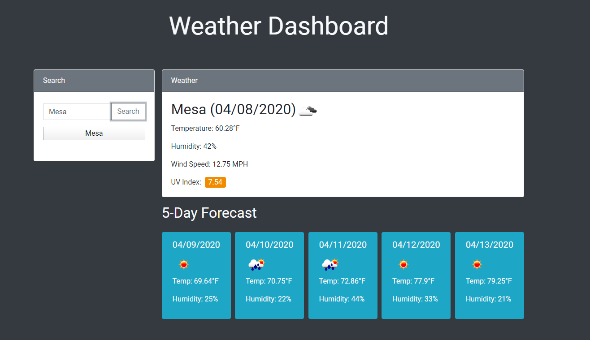

# weather-forecasting-app
Get current and 5 day weather updates for any city you search with Weather Dashboard!

## deployed website
http://stephenstuder.com/weather-forecasting-app/

## screenshot

## how it works
Uses Bootstrap, JQuery, JavaScript, and Open Weather Map API 

## notes
Just wanted to leave a note that i made a conscious decision to not reload the last searched weather in the dashboard on reload, just the buttons. I felt like a user with multiple recent searches would prefer to choose from a list of locally saved buttons. I personally dont like when decisions are made for me by the website as a user. If this does not satisfy the requirements i can add a single line function call and implement it. 
